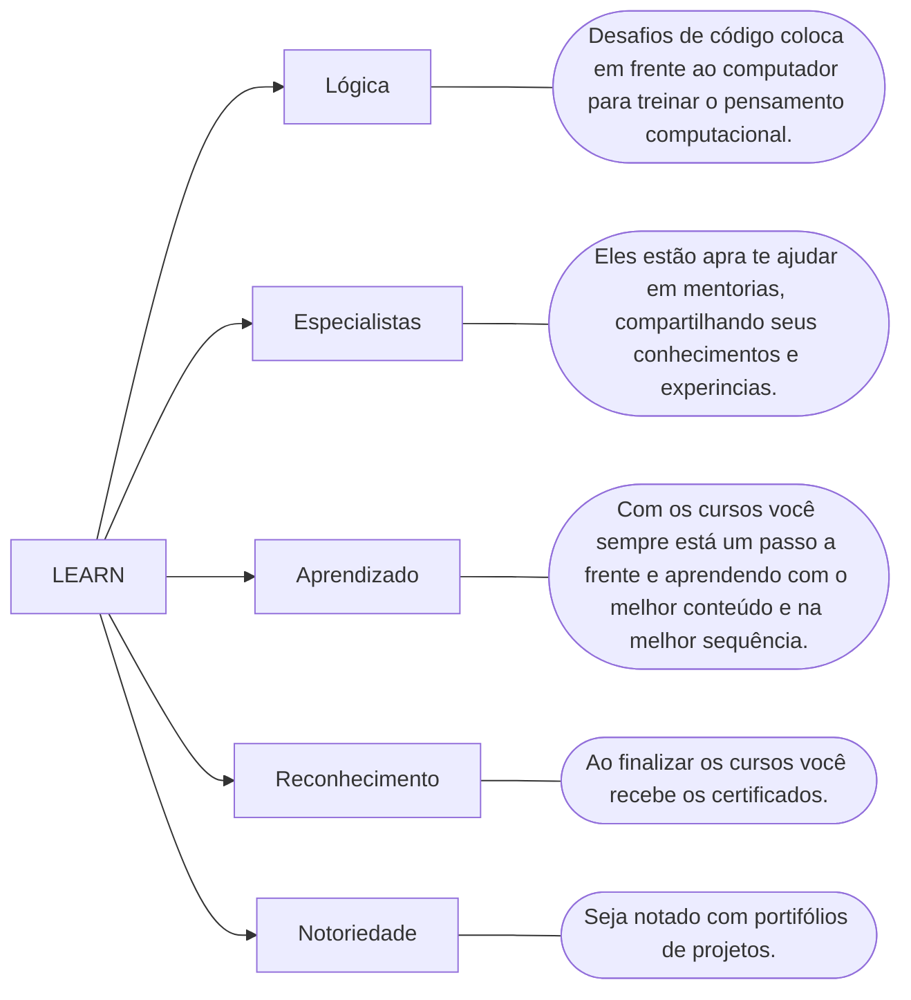
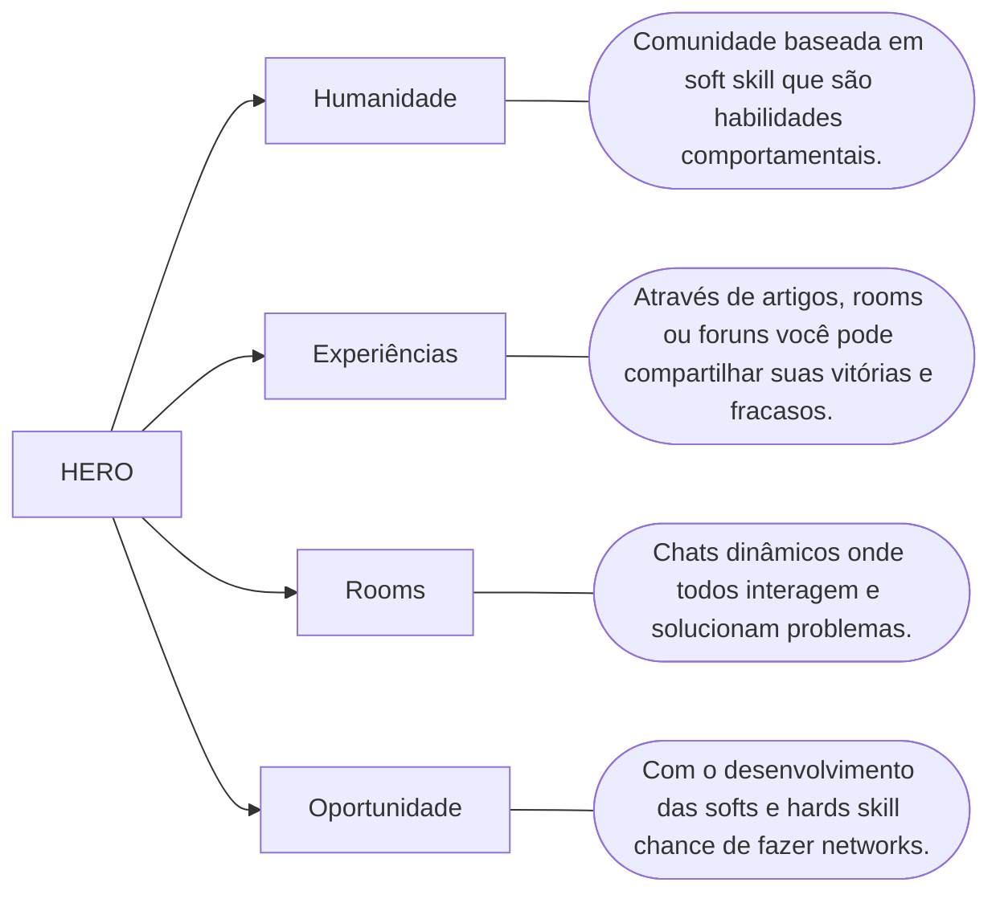
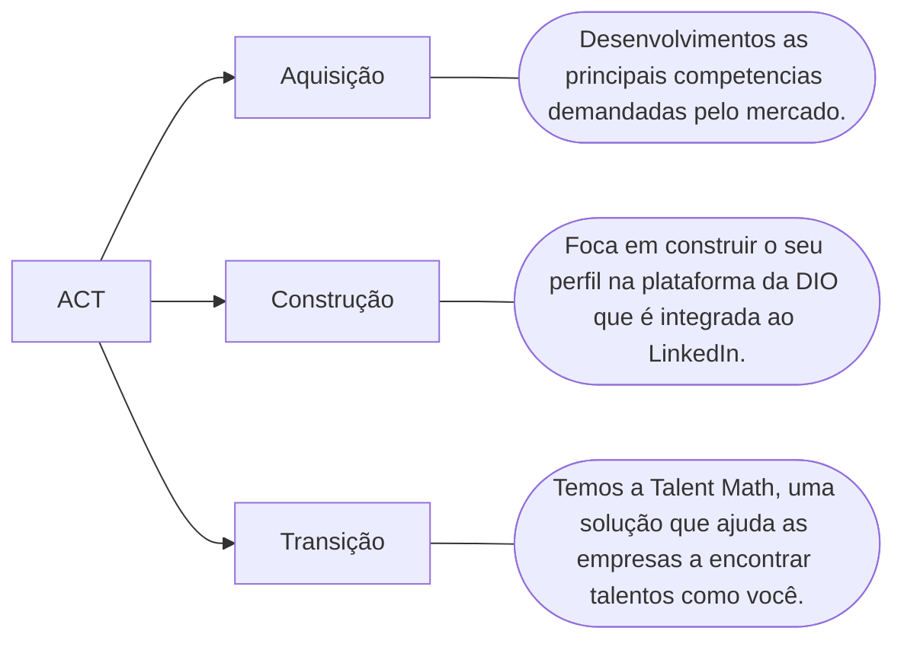

# Educação Gratuita e Empregabilidade Juntas!

## Metodologia da DIO <!--About DIO methodology / Sobre metodologia da DIO-->

A sigla que materializa o aprendizado pela DIO que podemos usar a palavra LEARN.

 

## Comunidade protagonista <!--About protagonist community / Sobre comunidade protagonista-->

Onde pessoas se conectam, compartilham e crescem juntos.

 

## Empregabilidade <!--About employability  / Sobre empregabilidade-->

Usamos a sigla ACT para descrever como ajudamos você a atingir os objetivos de carreira.

 

## Priorize suas tarefas <!--About prioritize your tasks / Sobre priorize suas tarefas-->

    
A chave para um gerenciamento eficaz do tempo é priorizar suas tarefas. É fácil se sobrecarregar com todas as responsabilidades e compromissos que você tem. Portanto, é essencial identificar quais tarefas são mais importantes e se concentrar nelas. Uma maneira comum de fazer isso é usando a <strong>Matriz Eisenhower</strong>. Essa ferramenta divide suas tarefas em quatro categorias: 

    <table border="1">
        <tbody>
            <tr>
                <th rowspan="4"></th>
                <th>Urgente e Importante</th>
                <th>Tarefas que exigem sua atenção imediata.</th>
            </tr>
            <tr>
                <th>Não Urgente e Importante</th>
                <th>Atividades que você precisa programar para fazer.</th>
            </tr>
            <tr>
                <th>Urgente e Não Importante</th>
                <th>Distrações que podem ser delegadas a outros.</th>
            </tr>
            <tr>
                <th>Não Urgente e Não Importante</th>
                <th>Tarefas que você pode considerar eliminar.</th>
            </tr>
        </tbody>
    </table>

 

## Gerenciamento do tempo <!--About time management / Sobre gerenciamento do tempo-->

    
Diversas técnicas de gerenciamento de tempo podem potencializar sua produtividade. A técnica <strong>Pomodoro</strong>, por exemplo, propõe trabalhar por 25 minutos seguidos e, em seguida, fazer uma pausa de 5 minutos (Figura 3). A cada quatro ciclos desses, é recomendada uma pausa mais extensa, de 15 a 30 minutos. Essa abordagem pode prevenir a sensação de esgotamento e manter sua concentração ao longo do dia.

    

    
Outra técnica útil é criar listas de tarefas, onde você anota tudo o que precisa fazer e, em seguida, prioriza as tarefas mais importantes. Conforme conclui cada tarefa, você a marca como concluída. Essa abordagem ajuda a manter o foco e a organização em seus estudos.

 <!--About back button / Sobre botão voltar-->
    <a href="../README.md">
        <button><strong>Voltar</strong></button>
    </a>

