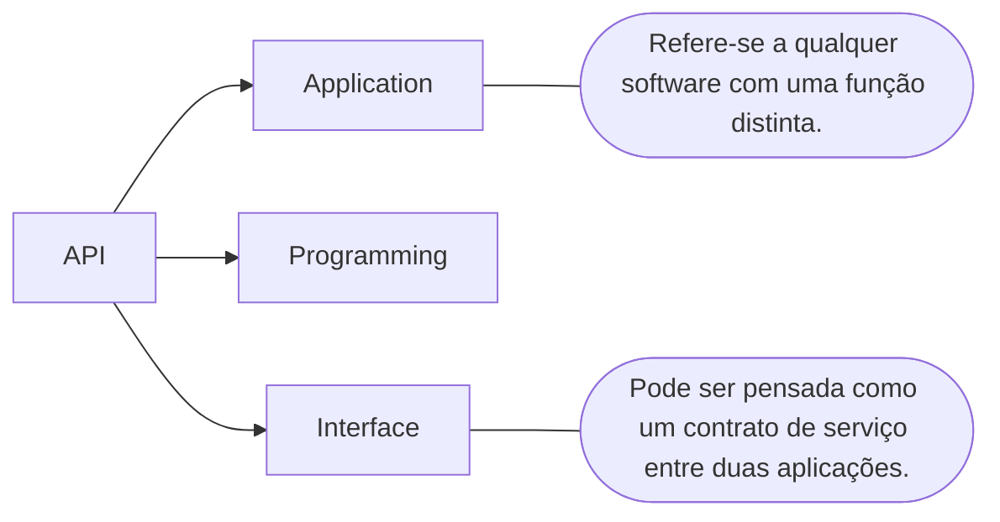
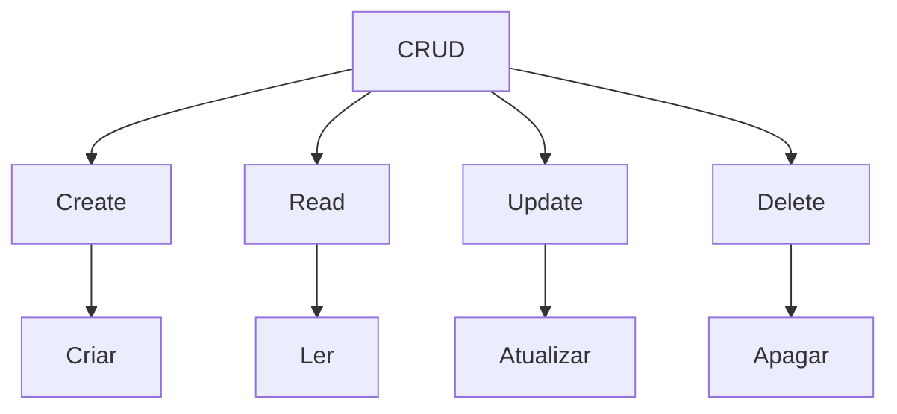

# Desenvolvimento Web com Spring Boot 3 e Kotlin

## Objetivos gerais <!--About general objectives / Sobre objetivos gerais-->

Vamos conhecer algumas ferramentas pertinentes para o desenvolvimento de um produto computacional de qualidade, uma Rest API sPring Boot e Kotlin

## Pré-requisitos <!--About prerequisites / Sobre pré-requisitos-->

<table border="1">
    <tbody>
        <tr>
            <th colspan="2">Aplicativos necessários</th>
            <th>Conhecimentos Prévios</th>
        </tr>
        <tr>
            <th>IntelliJ IDEA Community (IDE)</th>
            <th><a href="https://www.jetbrains.com/idea/download/?section=windows">Link</a></th>
            <th rowspan="3">Sintaxe básica de Kotlin e POO</th>
        </tr>
        <tr>
            <th>JDK 17+</th>
            <th><a href="https://www.oracle.com/br/java/technologies/downloads/">Link</a></th>
        </tr>
        <tr>
            <th>Kotlin 1.7.22</th>
            <th><a href="https://kotlinlang.org/">Link</a></th>
        </tr>
    </tbody>
</table>

 

## Arquitetura Rest <!--About rest architecture / Sobre arquitetura rest-->

API significa Application Programming Interface.

 

Arquitetura de API geralmente é explicada em termos de cliente e servidor, onde o <strong>cliente</strong> é quem envia a solicitação e o <strong>servidor</strong> é quem responde a esta solicitação.

    <table border="1">
        <tbody>
            <tr>
                <th rowspan="4"></th>
                <th>APIs SOAP</th>
                <th>
Cliente e servidor trocam mensagens usando XML.
</th>
            </tr>
            <tr>
                <th>APIs RPC
</th>
                <th>
O cliente conclui um procedimento no servidor e o servidor envia a saída de volta para o cliente.
</th>
            </tr>
            <tr>
                <th>APIs WebSocket</th>
                <th>
O servidor pode enviar mensagens de retorno de chamada a clientes conectados, tornando-o mais eficiente que a API Rest.
</th>
            </tr>
            <tr>
                <th>APIs Rest</th>
                <th>
O cliente envia solicitações ao servidor como dados, o servidor usa essa entrada do cliente para iniciar funções internas e retorna os dados de saída ao cliente.
</th>
            </tr>
        </tbody>
    </table>

 

### O que é uma API Rest?

    
REST significa Transferência Representacional de Estado. Clientes e servidores trocam dados usando HTTP.

    

 

### Métodos e Status HTTP

    <table border="1">
        <tbody>
            <tr>
                <th rowspan="4"></th>
                <th>GET</th>
                <th>Quando quero informação.</th>
                <th rowspan="4"></th>
            </tr>
            <tr>
                <th>POST</th>
                <th>Salvar uma informação.</th>
            </tr>
            <tr>
                <th>PUT ou PET</th>
                <th>Atualizar uma informação.</th>
            </tr>
            <tr>
                <th>Delete</th>
                <th>Deletar uma informação.</th>
            </tr>
        </tbody>
    </table>   

## Falta verificar <!--Estou verificando a posição do restante abaixo-->

Usamos a porta 8080

JSON é um formato de troca de dados entre sistemas independente de linguagem de programação derivado do Java Script.

Spring Framework
    Spring Boot Starters
    Spring Initializr
        Site: https://start.spring.io/

Arquitetura de três camadas tem por objetivo promover a separação das funcionalidades usando camadas para a separação lógica de apresentação, lógica de negócio e lógica de acesso a dados.

Arquivo de Configuração
    application.properties
    application.yml (visualmente melhor)

 <!--About back button / Sobre botão voltar-->
    <a href="../README.md">
        <button><strong>Voltar</strong></button>
    </a>

