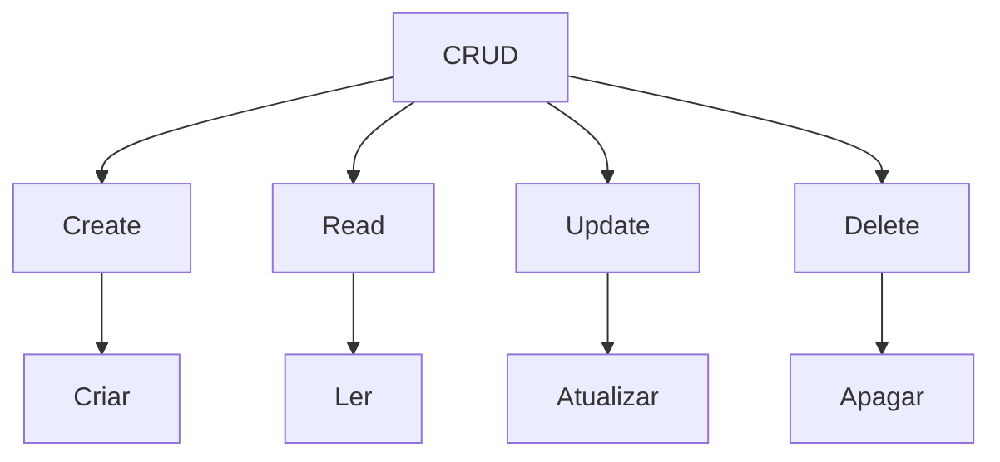

# Desenvolvimento Web com Spring Boot 3 e Kotlin

 <!--About menu required applications-->

Aplicativos Necessários

    <table border="1">
        <tbody>
            <tr>
                <th>IntelliJ IDEA Community (IDE)</th>
                <th><a href="https://www.jetbrains.com/idea/download/?section=windows">Link</a></th>
            </tr>
            <tr>
                <th>JDK 17+</th>
                <th><a href="https://www.oracle.com/br/java/technologies/downloads/">Link</a></th>
            </tr>
            <tr>
                <th>Kotlin 1.7.22</th>
                <th><a href="https://kotlinlang.org/">Link</a></th>
            </tr>
        </tbody>
    </table>   

 
Conhecimentos prévios: Sintaxe básica de Kotlin e POO.
 
API = Application Programming Interface
 
Aplicação refere-se a qualquer software com uma função distinta e Interface pode ser pensada como um contrato de serviço entre duas aplicações.
 
Cliente é uma aplicação que envia a solicitação e servidor é a aplicação que envia a resposta.
  

 <!--About menu HTTP methods-->

Métodos HTTP

    <table border="1">
        <tbody>
            <tr>
                <th>GET</th>
                <th>Quando quero informação.</th>
                <th rowspan="4"></th>
            </tr>
            <tr>
                <th>POST</th>
                <th>Salvar uma informação.</th>
            </tr>
            <tr>
                <th>PUT ou PET</th>
                <th>Atualizar uma informação.</th>
            </tr>
            <tr>
                <th>Delete</th>
                <th>Deletar uma informação.</th>
            </tr>
        </tbody>
    </table>   

 

API's REST
    REST significa Transferência Representacional de Estado.
    Clientes e servidores trocam dados usando HTTP.
    Usamos a porta 8080

JSON é um formato de troca de dados entre sistemas independente de linguagem de programação derivado do Java Script.

Spring Framework
    Spring Boot Starters
    Spring Initializr
        Site: https://start.spring.io/

Arquitetura de três camadas tem por objetivo promover a separação das funcionalidades usando camadas para a separação lógica de apresentação, lógica de negócio e lógica de acesso a dados.

Arquivo de Configuração
    application.properties
    application.yml (visualmente melhor)